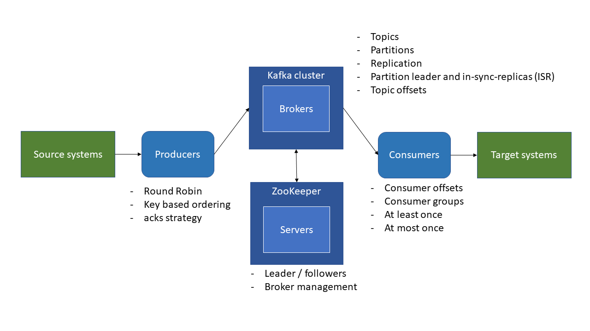

# [Summary](#summary)
1. [Introduction](#introduction)
1. [Kafka Theory](#kafka-theory)
    1. [Topics, Partitions, and Offsets](#topics\,-partitions\,-and-offsets)
    1. [Brokers and Topics](#brokers-and-topics)
    1. [Topic Replication](#topic-replication)
        1. [Concept of Leader for a Partition](#concept-of-leader-for-a-partition)
    1. [Producers](#producers)
    1. [Consumer](#consumers)
        1. [Consumer Groups](#consumer-groups)
        1. [Consumer Offsets](#consumer-offsets)
            1. [Delivery Semantics for Consumers](#delivery-semantics-for-consumers)
    1. [Kafka Broker Discovery](#kafka-broker-discovery)
    1. [ZooKeeper](#zookeeper)
    1. [Kafka Theory Roundup](#kafka-theory-roundup)
1. [Starting Kafka](#starting-kafka)
    1. [Starting ZooKeeper](#starting-zookeeper)
    1. [Starting Kafka](#starting-kafka)
    1. [Stopping Kafka and ZooKeeper](#stopping-kafka-and-zookeeper)
    1. [Troubleshooting](#troubleshooting)
1. [Command Line Interface](#command-line-interface)
    1. [Topics](#topics)
    1. [Console Producer](#console-producer)
    1. [Console Consumer](#console-consumer)
1. [Applications](#applications)
    1. [Talk Between Two Clients](#talk-between-two-clients)
        1. [Client Setup](#client-setup)


# [Introduction](#summary)
This document is a compilation of Kafka concepts and commands gathered from various websites in my efforts to learn the platform. The LinkedIn Learning course *Learn Apache Kafka for Beginners* by [Stephane Maarek](https://www.linkedin.com/in/stephanemaarek/?trk=lil_course) ([@simplesteph](https://github.com/simplesteph)) is the main source I have visited to study Kafka. 

The CLI commands here are given for Linux machines. If on Windows, replace *`.sh`* with *`.bat`* at the end of the commands.

# [Kafka Theory](#summary)

## [Topics, Partitions, and Offsets](#summary)
* *Topic*: one particular stream of data
* *Partition*: where a topic gets split into
* *Offset*: incremental ID received by each message that is written under a topic
* Data (messages) is kept only for a limited time of 1 week by default, but it keeps on incrementing the offeset, never going back to zero
* Data cannot be changed once written to a partition---this is called immutability    
* Data is assigned randomly to a partition unless a key is provided

## [Brokers and Topics](#summary)
* A Kafka cluster is a set of brokers (servers)
* Each broker has an ID number
* Upon connecting to a broker, you can have access to its entire cluster
* Each broker can have a different partition, which can store messages from the same topic. One broker also can have zero or more than one partition with the same topic

## [Topic Replication](#summary)
* Topics should have a replication factor bigger than 1 (3 is the gold standard) so that if a broker is down, another broker can serve the data
* The partitions, which carry the topics, are the ones that actually become replicas in different brokers

### [Concept of Leader for a Partition](#summary)
* Only ONE broker can be a leader for a given partition
* Only that leader can receive and serve data for a partition---the other brokers will sync the data, generating in-sync replicas (ISR)

## [Producers](#summary)
* Producers write data to topics (automatically know which broker and partition to write to)
* Producers can choose receive acknowledgement of data writes:
    * **acks=0** --> producer won't wait for acknowledgement (can result in data loss)
    * **acks=1** (default) --> wait for leader's acknowledgment (limited data loss) 
    * **acks=all** --> leader + replicas's acknoledgment (no data loss)
* Producers can choose send a key (string or number) with the message 
    * **key=null** --> data is sent round robin, which tends to write to partition topics evenly (load balancing)
    * By specifying a key, you can garantee message ordering---messages with the same key will always go the same partition 

## [Consumers](#summary)
* Consumers read data from a topic
* For a given partition, the data is read in a FIFO basis (and consumers intermitently circle around brokers in which the given topic resides while reading the data)

### [Consumer Groups](#summary)
* Consumers read data in consumer groups
* The number of partitions that each consumer within a group reads depends on the number of partitions and consumers:
    * `No. Cons. < No. Part.` --> some consumers read from more than one partition
    * `No. Cons. = No. Part.` --> each consumer reads from only one partition
    * `No. Cons. > No. Part.` --> some consumers will read their exclusive partitions, the remaining consumers get idle

### [Consumer Offsets](#summary)
* *Consumer offsets*: stores the last offset read by a consumer group
* The offsets are committed live to a topic named ***__consumer_offsets***
* ***__consumer_offsets*** allows a consumer group to read back from where it left off

#### [Delivery Semantics for Consumers](#summary)
* Consumers can choose when to commit offsets
    * **At most once** --> offsets are committed when message is received---if anything goes wrong amid the transmission, the message will be lost
    * **At least once** (preferred) --> offsets are committed after the message is processed---if an error occurs, the message can be read again (make sure that processing the message more than once won't impact your system)
    * **Exactly once** --> achieved using Kafka Streams API or an idempotent consumer

## [Kafka Broker Discovery](#summary)
* Every Kafka broker is also called a "bootstrap server" (by connecting to one broker, you connect to the entire cluster)
* Each broker knows about all brokers, topics, and partitions

## [Zookeeper](#summary)
* Operates with an odd number of servers in production (although examples in this document use only one server)
* When in production, it has one server as the leader and the remaining servers as followers
* Chooses the partition leader in a set of partitions
* Stores matadata on Kafka's components (brokers, partitions, topics)---apparently, the server leader can read and write to a partition the  and the followers can only read it
* Sends notifications to Kafka when changes are applied to the metadata---still have to verify this statement
* Does not store consumer offsets since Kafka 0.11
> znode is the shortname for ZooKeeper node, also known as server

## [Kafka Theory Roundup](#summary)


# [Starting Kafka](#summary)
To start Kafka, Zookeeper has to be already running in the background. Before going into that, let's go over Kafka environment's configuration briefly. 

First, install Java JDK (or OpenJDK) and set up its environment variable. 

> ## Environment variable setup
> 
> *Linux*: 
> 1. ```vim /home/<username>/.profile``` 
> 1. Add ```export PATH="$PATH:/<path_to_kafka>/bin"```
> 1. ```source /home/<username>/.profile```
> 
> *Windows*: 
> * Navigate to ```Control Panel\System and Security\System``` and click on *Advance System Settings*

Second, add all Kafka executables (localted in the ***bin*** directory) to the list of enviorment variables.

Third, create a ***data*** directory and its ***kafka*** and ***zookeeper*** subdirectories under the Kakfa installation folder.

Then make the following changes to their respective property files found under the folder ***config***:

*Linux*

* *zookeeper.properties*: 
    ```
    dataDir=/home/<username>/<kafka_installation_folder>/data/zookeeper
    ```
* *server.properties*:
    ```
    log.dirs=/home/<username>/<kafka_installation_folder>/data/kafka
    ```

*Windows*

* *zookeeper.properties*: 
    ```
    dataDir=<partition_name>:/<kafka_installation_folder>/data/zookeeper
    ```
* *server.properties*:
    ```
    log.dirs=<partition_name>:/<kafka_installation_folder>/data/kafka
    ```


## [Starting ZooKeeper](#summary)
In one terminal, navigate to your Kafka installation directory and start ZooKeeper with the following command:
```
zookeeper-server-start.sh config/zookeeper.properties
```
You should see `INFO binding to port 0.0.0.0/0.0.0.0:2181` along the lines of the message given, which is a sign that everything went well.

## [Starting Kafka](#summary)
Using a different terminal instance, in your Kafka installation directory, start Kafka with the following command:
```
kafka-server-start.sh config/server.properties
```
If you see `INFO [GroupMetadataManager brokerId=0]` as a reponse, Kafka was initialized successfully.

## [Stopping Kafka and Zookeeper](#summary)
You can stop Kafka and Zookeeper processes by either one of the following:
* Pressing ctrl+c
* Using `zookeeper-server-stop.sh` or `kafka-server-stop.sh`

## [Troubleshooting](#summary)
If you get an error, there might be a running process listening to the port Zookeeper or Kafka are trying to bind to. If that is the case, look for what PID is associated with that port and kill that process. 

> By default, Zookeeper and Kafka bind to ports 2181 and 9092, respectively.

A way of terminating the process is as follows:
* *Windows*:
    1. Find the PID listening to Kafka or Zookeeper's port
        ```
        netstat -ano | findstr :<port_number>
        ```
    1. Kill that PID
        ```
        taskkill /PID <pid_number> /F
        ```
* *Linux*
    1. Find the PID listening to Kafka or Zookeeper's port
        ```
        netstat -ltnp | grep -w ":<port_number>"
        ```
    1. Kill that PID
        ```
        kill -9 <pid_number>
        ```

# [Command Line Interface](#summary)
This section shows how to use Kafka command lines through the terminal (requires a third terminal instance to be open).

## [Topics](#summary)
Argument `--zookeeper` is used throughout but is depricated. Please replace it with `--bootstrap-server`.
* Create a topic
    ```
    kafka-topics.sh --zookeeper 127.0.0.1:2181 --topic <topic_name> --create --partitions <no_of_parts> --replication-factor <repl_factor_no>
    ```
    > The replication factor can't be bigger than the number of Kafka brokers.

* List existing topics
    ```
    kafka-topics.sh --zookeeper 127.0.0.1:2181 --list
    ```

* Describe a topic
    ```
    kafka-topics.sh --zookeeper 127.0.0.1:2181 --topic <topic_name> --describe
    ```

* Delete a topic
    ```
    kafka-topics.sh --zookeeper 127.0.0.1:2181 --topic <topic_name> --delete
    ```

## [Console producer](#summary)
* Producing messages (offsets)
    ```
    kafka-console-producer.sh --broker-list 127.0.0.1:9092 --topic <topic_name> --producer-property acks=[all|1|0]
    ```

## [Console consumer](#summary)
* Consuming messages
    ```
    kafka-console-consumer.sh --bootstrap-server 127.0.0.1:9092 --topic <topic_name> --from-beginning
    ```
    
* Set up group name
    ```
    kafka-console-consumer.sh --bootstrap-server 127.0.0.1:9092 --topic <topic_name> --group <group_name>
    ```
    > ### Notes 
    > * If console consumers (applications) are under the same group name, they will share the broker partitions evenly
    > * If there is a lag<sup>*</sup> in any partition group and that group is invoked with a console consumer command, such group-name consumer picks up from the offset where it's left and consumes up to the last offset committed
    >
    > <sup>*</sup>the current offset is not the last one registered in the partition 

* List all groups
    ```
    kafka-consumer-groups.sh --bootstrap-server localhost:9092 --list
    ```

* Describe group
    ```
    kafka-consumer-groups.sh --bootstrap-server localhost:9092 --describe --group <group_name>
    ```

* Reset topic offsets
    * Move the pointer to the beginning of each partition
        ```
        kafka-consumer-groups.sh --bootstrap-server localhost:9092 --group my-first-application --reset-offsets --to-earliest --execute --topic <group_name>
        ```
    * Shift the pointer (usually backwords)
        ```
        kafka-consumer-groups.sh --bootstrap-server localhost:9092 --group my-first-application --reset-offsets --shift-by (+/-)<no_of_moves> --execute --topic <group_name>
        ```

# [Applications](#summary)
Here are some simple applications I have created so far.

## [Talk Between Two Clients](#summary)
This is a simple application of Kafka concepts. The porpuse is to produce data with a Linux client and consume it with a Windows client, and vice-versa. 

### [Client Setup](#summary)
The setup below should be done from both Linux and Windows client. `<ip_address>` was taken from the section *ethernet adapter vEthernet (WSL)* shown upon using `ipconfig` on Windows.

Start Kafka:
1.  ```
    zookeeper-server-start.sh config/zookeeper.properties
    ```
1.  ```
    kafka-server-start.sh config/server.properties
    ```

Set up producer and consumer:
1.  ```
    kafka-console-producer.sh --broker-list <ip_address>:9092 --topic linux_to_windows
    ```
1.  ```
    kafka-console-consumer.sh --bootstrap-server <ip_address>:9092 --topic --group <group_name> windows_to_linux
    ```
